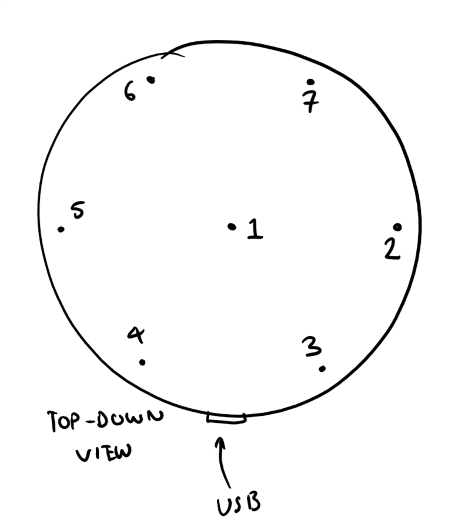

# Birdsong analysis using miniDSP UMA8 microphone array

## Microphone coordinate analysis
First off, the coordinates of the microphones, measured using photoshop -
scaled the diagram so that the board had diameter of 90mm, and then
measured the coordinates of a visually estimated centroid of each
microphone. We used a top-down view, with the USB port pointing directly
down. Positive y is upward, positive x is rightward.

Coordinates (in mm) of the microphones (center first) are:

x       y
-----   -----
0       0
42.6    -0.5
21.4    36.2
-21.2   35.8
-42.3   -0.8
-21.2   -37.7
21.5    -37.7

We now need to devise an experiment to figure out which one is which
(according to the microphone order reported by Windows, which is hopefully
consistent!) Will just do an experiment when I play a tone directly at the
device from each of the six directions, the closest microphone will be the
leading signal.

We think this is the corresponding layout, this would make sense as the
first microphone is in the center, and they are in order around the edges.

## Accurately measuring position
In the data set "uma8 cal 2", a slightly more careful whistle experiment
was performed. I've whistled in sequence at microphones 2,7,6,5,4,3 from
further away, so that it's more approximately a plane wave on arrival.

To optimise for position, we'll need to optimise the seven microphone
positions, while holding theta approximately constant. This will also
optimise the theta error, so we need to take this into account.

I'm thinking that we take a window during each of the whistles, and then
incorporate the six positions for all of these simultaneously.

## Some distance / wavelength / sample conversions for reference

Note: at a sample rate of 48000, and a speed of sound of around 340m/s, the
maximum distance between two microphones is around 85mm, which translates
to around 12 samples. This is not a lot.

Frequency(Hz)   Wavelength (m)  Period (s)  Number of samples
-------------   --------------  ----------  -----------------
100             3.43            0.01        480
200             1.72            0.005       240
500             0.69            0.002       96
1000            0.34            0.001       48
2000            0.17            0.0005      24
5000            0.069           0.0002      9.6
10000           0.034           0.0001      4.8
15000           0.023           0.000067    3.2

Table: Reference table of frequency and wavelengths (supposing 48000 sample rate):

